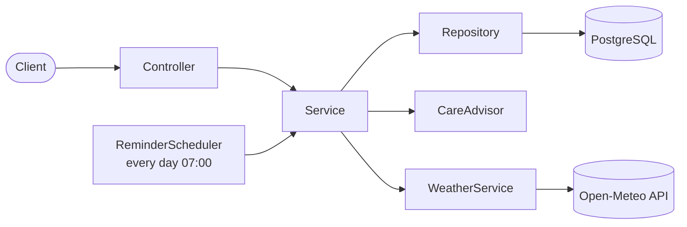

# 🪴 PlantCare API

A Spring Boot REST API that keeps track of your plants **and the weather in Jerusalem**, tells you which plants need water today, and sends a reminder every morning.


---

## ✨ Features

- **Plant management**: add plants, set how often each one needs water, and see its current status (`OK`, `THIRSTY`, `OVERDUE`).
- **Watering history**: every watering is logged with an optional note.
- **Live weather for Jerusalem**: fetched from [Open-Meteo](https://open-meteo.com/) (free, no API key).
- **Weather-aware advice**: rain, heat waves and frost change the recommendation for outdoor plants.
- **Daily reminders**: a scheduled job runs every day at 07:00 (Jerusalem time) and reports the plants that need attention.
- **Clean error responses**: validation and "not found" errors are returned as standard `ProblemDetail` JSON.
- **Resilient by design**: if the weather service is down, the app keeps working without weather data.

## 🌦️ How the weather changes the advice

| Condition (today, Jerusalem) | Applies to     | Effect                                    |
| ---------------------------- | -------------- | ----------------------------------------- |
| Rain ≥ 2 mm                  | Outdoor plants | Skip watering, status is `OK`             |
| Max temperature ≥ 35 °C      | Outdoor plants | Watering interval is shortened by one day |
| Min temperature ≤ 2 °C       | Outdoor plants | Frost warning is added to the advice      |
| Any weather                  | Indoor plants  | Ignored                                   |

Without weather rules, the status is based on the days since the last watering:

| Days since watering    | Status    |
| ---------------------- | --------- |
| Less than the interval | `OK`      |
| Exactly the interval   | `THIRSTY` |
| More than the interval | `OVERDUE` |

## 🏗️ Architecture



| Layer                 | Responsibility                                                   |
| --------------------- | ---------------------------------------------------------------- |
| **Controller**        | HTTP only: routes, input validation, status codes                |
| **Service**           | Business logic and orchestration                                 |
| **CareAdvisor**       | Pure decision logic (no Spring, no DB), easy to unit test        |
| **WeatherService**    | Calls the external weather API with timeouts and a safe fallback |
| **Repository**        | Spring Data JPA access to PostgreSQL                             |
| **ReminderScheduler** | Daily `@Scheduled` job                                           |

## 🧰 Tech stack

- Java 21+
- Spring Boot 4 (Web MVC, Data JPA, Validation, Scheduling)
- Hibernate / JPA
- PostgreSQL 16 (via Docker Compose)
- Spring `RestClient` for the Open-Meteo integration
- Lombok
- JUnit 5

## 📁 Project structure

```
plantcare/
├── pom.xml
├── docker-compose.yml
└── src/
    ├── main/
    │   ├── java/com/example/plantcare/
    │   │   ├── PlantcareApplication.java
    │   │   ├── controller/    PlantController, WeatherController
    │   │   ├── service/       PlantService, WeatherService, CareAdvisor, ReminderScheduler
    │   │   ├── repository/    PlantRepository, WateringLogRepository
    │   │   ├── model/         Plant, WateringLog, PlantLocation, PlantStatus
    │   │   ├── dto/           CreatePlantRequest, PlantResponse, WateringLogResponse,
    │   │   │                  WeatherInfo, PlantAdvice
    │   │   └── exception/     ResourceNotFoundException, GlobalExceptionHandler
    │   └── resources/
    │       └── application.yml
    └── test/java/com/example/plantcare/
        └── service/CareAdvisorTest.java
```

## 🚀 Getting started

### Prerequisites

- JDK 21 or newer
- Docker Desktop (running)
- Maven (or use the included wrapper)

### 1. Clone the repository

```bash
git clone https://github.com/<your-username>/plantcare.git
cd plantcare
```

### 2. Start the database

```bash
docker compose up -d
docker compose ps
```

The `PORTS` column should show `0.0.0.0:5433->5432/tcp`.

### 3. Configure the application

`src/main/resources/application.yml`:

```yaml
spring:
  datasource:
    url: jdbc:postgresql://localhost:5433/plantdb
    username: postgres
    password: secret
  jpa:
    hibernate:
      ddl-auto: update
    show-sql: true
```

> `ddl-auto: update` is convenient for development. For production, use a migration tool such as Flyway.

### 4. Run

```bash
./mvnw spring-boot:run        # macOS / Linux
mvnw.cmd spring-boot:run      # Windows
```

The API is now available at `http://localhost:8080`.

### 5. Run the tests

```bash
./mvnw test
```

## 📡 API reference

| Method | Endpoint                 | Description                                               |
| ------ | ------------------------ | --------------------------------------------------------- |
| `POST` | `/api/plants`            | Create a plant                                            |
| `GET`  | `/api/plants`            | List plants. Optional filter: `?status=THIRSTY`           |
| `GET`  | `/api/plants/{id}`       | Get one plant with its current status and advice          |
| `POST` | `/api/plants/{id}/water` | Log a watering. Optional: `?note=morning`                 |
| `GET`  | `/api/plants/{id}/logs`  | Watering history, newest first                            |
| `GET`  | `/api/weather/jerusalem` | Today's weather as seen by the app (`503` if unavailable) |

### Create a plant

```bash
curl -X POST http://localhost:8080/api/plants \
  -H "Content-Type: application/json" \
  -d '{"name":"Basil","species":"Ocimum basilicum","location":"OUTDOOR","wateringIntervalDays":2}'
```

Response `201 Created`:

```json
{
  "id": 1,
  "name": "Basil",
  "species": "Ocimum basilicum",
  "location": "OUTDOOR",
  "wateringIntervalDays": 2,
  "lastWateredAt": "2026-10-08",
  "status": "OK",
  "advice": "Last watered 0 days ago."
}
```

### Water a plant and check history

```bash
curl -X POST "http://localhost:8080/api/plants/1/water?note=morning"
curl http://localhost:8080/api/plants/1/logs
```

### Validation error

```bash
curl -X POST http://localhost:8080/api/plants \
  -H "Content-Type: application/json" \
  -d '{"name":"","location":"INDOOR","wateringIntervalDays":0}'
```

Returns `400 Bad Request` with a `ProblemDetail` body listing the invalid fields.

## ⏰ Daily reminders

`ReminderScheduler` runs with the cron expression `0 0 7 * * *` in the `Asia/Jerusalem` time zone. It collects every plant whose status is not `OK` and logs a reminder for each:

```
REMINDER: Basil is THIRSTY. Last watered 2 days ago. Heat wave (37.0C): watering more often.
```

Currently reminders are written to the application log. The scheduler is the single place to plug in email, Telegram or push notifications.

## 🧪 Testing

`CareAdvisorTest` covers the decision logic without starting Spring or a database:

- plant is `OK` when recently watered
- plant is `THIRSTY` on the due day
- plant is `OVERDUE` after the due day
- rain makes an outdoor plant skip watering
- a heat wave shortens the interval
- indoor plants ignore the weather

## 🗺️ Roadmap

- [ ] Store daily weather snapshots in the database
- [ ] Cache weather responses (`@Cacheable`)
- [ ] 3-day forecast ("rain tomorrow, skip today")
- [ ] Email or Telegram notifications
- [ ] Flyway migrations instead of `ddl-auto`
- [ ] Controller tests with `@WebMvcTest` and integration tests with Testcontainers
- [ ] Authentication with Spring Security and JWT
- [ ] OpenAPI / Swagger documentation

## 🙏 Credits

Weather data by [Open-Meteo.com](https://open-meteo.com/) (CC BY 4.0).

## 📄 License

MIT
